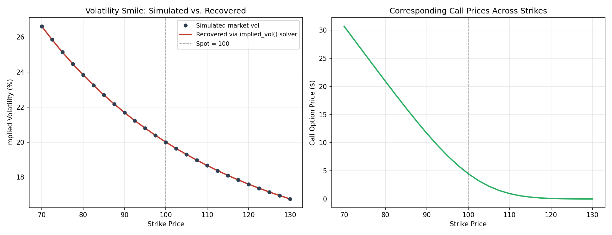
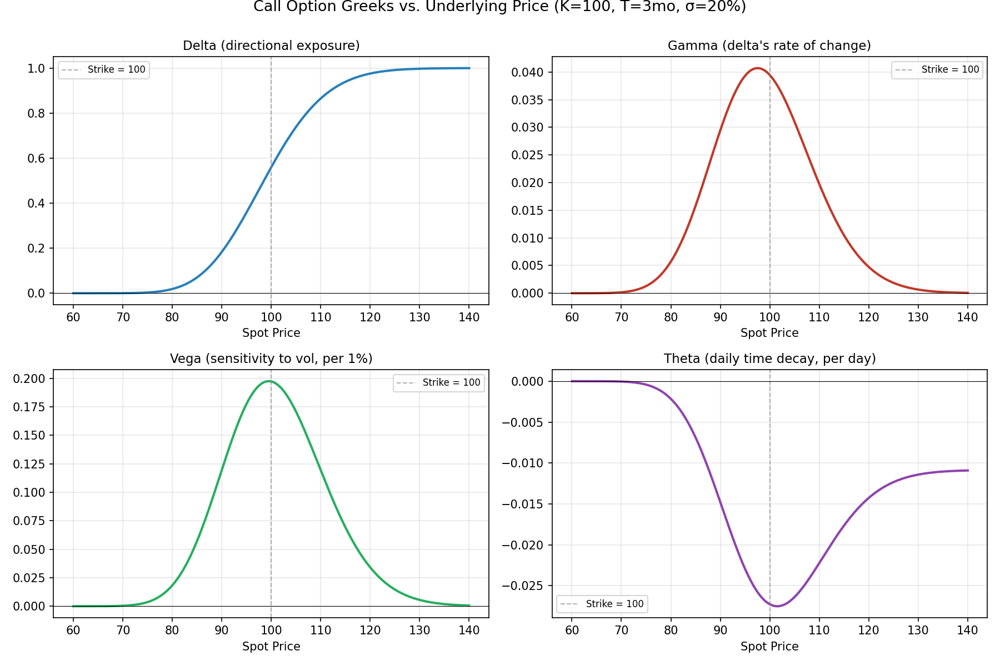

# Black-Scholes Options Pricer & Implied Volatility Solver


A from-scratch implementation of the Black-Scholes-Merton model, built to
understand — not just use — how options pricing, Greeks, and implied
volatility actually work under the hood.

## Why I built this

I'm a CS/legal-background candidate transitioning into quantitative trading
recruiting. Most of what I could show on paper was math coursework and
prior professional experience in law and entrepreneurship — none of it
proved I could translate a pricing model into working, tested code. This
project was my way of closing that gap: pick a model every trading desk
uses daily, implement it correctly, verify it against known analytical
properties, and visualize the parts of it that actually matter for risk
(the Greeks, the smile).

## What's in here

| File | What it does |
|---|---|
| `black_scholes.py` | Core pricer: `bs_price()`, analytical `bs_greeks()`, and a Brent's-method `implied_vol()` solver |
| `vol_smile.py` | Simulates a realistic negatively-skewed volatility smile, prices it, then recovers it using the implied vol solver — proving the pricing → market price → implied vol pipeline is internally consistent |
| `greeks_analysis.py` | Plots how Delta, Gamma, Vega, and Theta behave as the underlying price moves, with the key intuitions (e.g. gamma peaks ATM) printed alongside the plots |
| `test_black_scholes.py` | 10 unit tests validating the pricer against known analytical properties (put-call parity, delta bounds, deep ITM/OTM limits, etc.) — not just "does it run," but "is it *correct*" |

## Key results

**Put-call parity holds to floating-point precision** (`diff = 7.11e-15`),
confirming the call and put formulas are internally consistent with each
other, not just individually plausible.

**The implied vol solver round-trips exactly**: pricing at a known vol and
then solving backward for implied vol recovers the original input to 6+
decimal places. This is the same logic a trading desk uses to convert
observed market prices into a comparable vol number across strikes and
expiries.

**Greeks behave exactly as theory predicts:**
- Delta is bounded in [0,1] for calls, [-1,0] for puts, and sits near 0.5 at-the-money
- Gamma is always positive and peaks exactly at-the-money — this is *why* ATM options are the hardest to hedge, since your hedge ratio is changing fastest right there
- Theta is most negative at-the-money — ATM options carry the most extrinsic value, so they lose the most to time decay per day
- Vega is always positive — more volatility can never make an option worth less

## Volatility smile



Black-Scholes assumes one constant volatility for every strike, but real
markets don't price it that way — options further from the money (especially
puts) trade at higher implied vol than at-the-money options, a pattern that's
persisted since the 1987 crash priced in asymmetric tail risk. I simulated a
smile with a simple skew/curvature model, priced options off it, then fed
those prices back through my own solver to confirm it recovers the smile
almost exactly (`max diff = 2.18e-09`).

## Greeks across the underlying



## Real market data

`real_market_smile.py` pulls a **live** option chain (via Yahoo Finance) for
any ticker, backs out implied volatility from actual traded prices using the
same `implied_vol()` solver above, and plots the real smile the market is
pricing right now -- not a simulation.

```bash
python3 real_market_smile.py AAPL     # or any optionable ticker
```

This is the step that moves the project from "the math is implemented
correctly" (which the simulated smile above already proves) to "the model
was pointed at real, live market data." Strikes where the solver can't find
a valid implied vol are skipped and reported rather than silently dropped --
usually deep ITM/OTM options with stale or crossed quotes, which is a real
data-quality issue on real order books, not a bug in the pricer.

## Running it

```bash
pip install numpy scipy matplotlib pytest

python3 black_scholes.py        # sanity checks + put-call parity
python3 vol_smile.py            # generates vol_smile.png
python3 greeks_analysis.py      # generates greeks_vs_spot.png
python3 -m pytest -v            # run the full test suite
```

## What I'd build next

- Add a binomial tree pricer for American-style options, where early exercise breaks the closed-form Black-Scholes solution
- Extend the implied vol solver to build a full SVI (stochastic volatility inspired) surface fit across strikes and expiries simultaneously, using the live data pipeline above
- Fetch the risk-free rate live (e.g. from `^IRX`) instead of the hardcoded constant in `real_market_smile.py`

---
*Built by Sa'Mara Roberts*
